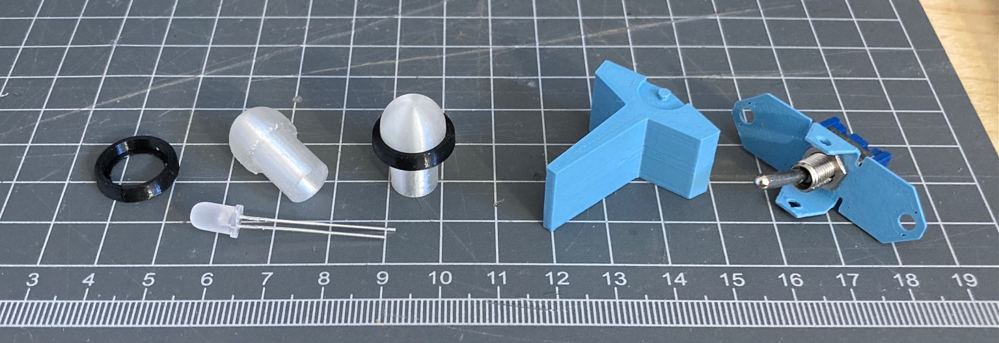

# 3D CAD

This directory contains all the 2D/3D models for components which are 3D printed or made from sheet metal.

 

```
.
├── 5mm-light-cover-decorator-ring.FCStd       # Black ring around the LED diffuser
├── 5mm-light-cover-decorator-ring-Fillet.step 
├── 5mm-light-cover.FCStd                      # LED diffuser
├── 5mm-light-cover-Revolve.step
├── Front-Panel-Assy.FCStd                     # Minimal assembly to check part alignment
├── Front-Panel.FCStd                          # User-facing front panel
├── Front-Panel-Unfold.dxf                     # FP. Order 0.1" sheet metal
├── Front-Panel-Rear-Plate.FCStd               # Mounting plate for switches and FP PCB
├── Front-Panel-Rear-Plate-Unfold.dxf          # FP PCB plate. 0.1" 5052 Al, K=0.4, R=0.125", 90 degree bend
├── Outlet-Panel.FCStd                         # Panel for Relay Board and Outlets.
├── Outlet-Panel-Unfold.dxf                    # Panel for Relay Board and Outlets. 0.1" 5052 Al, K-0.4 R=0.125", 90 degree bend, M3 hardware
├── Paddle-Switch-Bracket-Cut2.step            # Mount/pivot bracket for paddle switch
├── Paddle-Switch-Bracket-Cut.step             # Mount/pivot, slightly wider for 3D printing
├── Paddle-Switch-Bracket.FCStd
├── Paddle-Switch-Bracket-Unfold.dxf           # Mount/pivot. 0.03" thick K=0.36, 90 degree bends
├── Paddle-Switch-Cut.step                     # Paddle switch handle, "square"
├── Paddle-Switch.FCStd
└── Paddle-Switch-Fillet.step                  # Paddle switch handle, "rounded"
```

Everything has been designed in FreeCAD, but this directory also contains the STEP file from the latest "working" version of the file so you shouldn't need to edit the FCStd files unless you want to tweak them.

## Print Settings

I have printed my copies in PETG (Prusa and Creality) and the following settings work well with a 0.4mm nozzle.

**light cover decorator ring**

* Color: black
* 0.1mm layer height.

**light cover**

* Color: translucent
* 0.1mm layer height
* Print facing upwards so it looks like a small mushroom. Use supports under the outer brim. No supports needed on the inside.
* 100% infill, concentric

**paddle switch bracket**

* Color: any ("Chalky blue" pictured above)
* 0.1mm layer height
* Add support material within the pivot holes on either side. You may need a 3/32" bit to clean the hole afterwards.
* Wait for the bed to cool completely before removing!
* Note: there is also a `.dxf` file if you want this made from sheet metal. See the dir listing comments for details.

**paddle switch**

* Color: any ("Chalky blue" pictured above)
* 0.1mm layer height
* Print on its side like the above image
* Use supports for all overhangs (around the pivot and the inside ledge)

