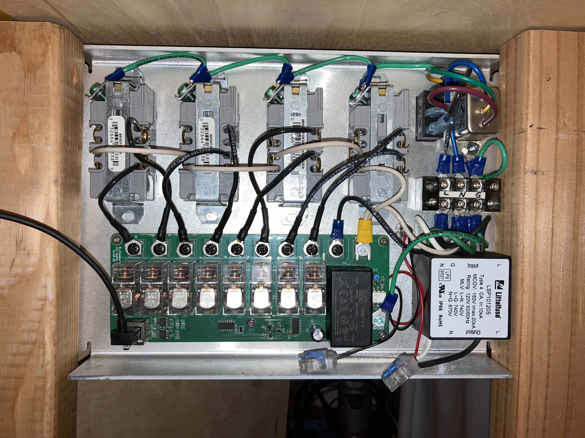
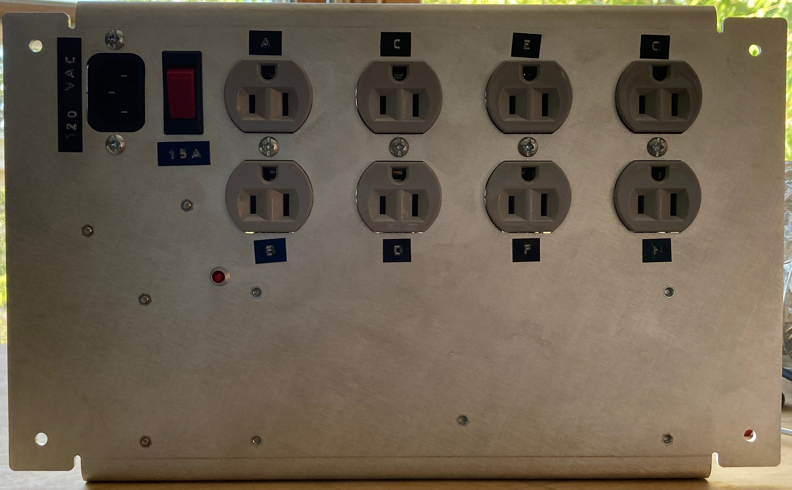

# Custom Remote-Controlled Power Distribution Panel

The control panel provides control over eight individually switched outlets for managing the numerous gizmoes plugged in to your workbench. In addition, there is a master switch which overrides the rest of the panel for shutting down all outputs.

The device is constructed of two components. The first (pictured above) is the control panel. This contains a PCB that uses a shift register to parallel load the state of the input switches and send them over an ethernet-style cable to the second component, the relay board. The relay board is responsible for generating the clock and load signals used by the control panel. It also shifts in the data from the control panel and drives a bank of eight relays to control attached devices.

All the design files are included in this repo. For more background and pictures, checkout [my website](https://zrcn.org/power-control-panel.html).

